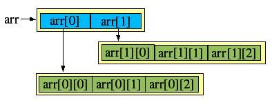

# June 16th - 22nd

## Algorithm

given  a number n, generate an n\*n matrix which rotates like this:

n=3, outputs:

1  2  3

8  9  4

7  6  5

```java
public class Main {

    public static void main(String[] args) {

        int n = 4; // can change to other value
        int [][] matrix = new int[n][n];

        rotating(n,matrix);

        for(int i = 0;i<n;i++){
            for(int j=0;j<n;j++){
                System.out.printf("%4d",matrix[i][j]);
            }
            System.out.print("\n");
        }


    }

    private static void rotating(int n, int[][] m) {
        int k = 1;
        //i<=n/2, 不然n为奇数时中间的格子无法赋值
        for(int i=0;i<=n/2;i++){
            for(int j = i;j<=n-i-1;j++){
                m[i][j] = k++;			//to right, top
            }
            for(int j = i+1;j<=n-i-1;j++){
                m[j][n-i-1] = k++;			//go down, right
            }
            for(int j = n-i-2;j>=i;j--){
                m[n-i-1][j] = k++;			//to left, down
            }
            for(int j = n-i-2;j>=i+1;j--){
                m[j][i] = k++;			//go up, left
            }

        }
    }
}

```




## Review

This week, I read this doc: [https://docs.quantifiedcode.com/python-anti-patterns/](https://docs.quantifiedcode.com/python-anti-patterns/)

It talks about some common bad practices and how can we improve it. Here are some notes that I ignored before but found quite useful:

* In django queryset, using values\(\) otherwise you will query all the columns. [https://docs.quantifiedcode.com/python-anti-patterns/django/all/performance/inefficient\_database\_queries.html](https://docs.quantifiedcode.com/python-anti-patterns/django/all/performance/inefficient_database_queries.html)
* When trying to check whether a list contains certain value, try to change that list to a set or dict first. [https://docs.quantifiedcode.com/python-anti-patterns/performance/using\_key\_in\_list\_to\_check\_if\_key\_is\_contained\_in\_a\_list.html](https://docs.quantifiedcode.com/python-anti-patterns/performance/using_key_in_list_to_check_if_key_is_contained_in_a_list.html)
* Use named tuple when returning multiple values. [https://docs.quantifiedcode.com/python-anti-patterns/readability/not\_using\_named\_tuples\_when\_returning\_more\_than\_one\_value.html](https://docs.quantifiedcode.com/python-anti-patterns/readability/not_using_named_tuples_when_returning_more_than_one_value.html)
* In a function, try to keep the return value be the same. Raise an exception instead of returning None. [https://docs.quantifiedcode.com/python-anti-patterns/maintainability/returning\_more\_than\_one\_variable\_type\_from\_function\_call.html](https://docs.quantifiedcode.com/python-anti-patterns/maintainability/returning_more_than_one_variable_type_from_function_call.html)

## Tip & Share

In the previous django projects, I met some timezone related issues, so this week I spent some time trying to summarize how to set and use timezone correctly in django.

1. In settings.py

```text
TIME_ZONE = 'Asia/Singapore'
USE_TZ = True
```

When USE\_TZ is set to be true, Django uses time-zone-aware datetime objects. For most databases that do not support timezone, the time stored in db is in utc timezone. And when django displays those time, they will be converted according to the timezone information.

2. In program logic


Note the timezone info for now\(\) and localtime\(\) is different. So when we need to implement something like daily missions, it's important to use localtime.


Note that when calling get\_current\_timezone, it is in local mean time, which is different from daylight saving time.

dst: [https://zh.wikipedia.org/wiki/%E5%A4%8F%E6%97%B6%E5%88%B6](https://zh.wikipedia.org/wiki/%E5%A4%8F%E6%97%B6%E5%88%B6)

lmt: [https://www.timeanddate.com/time/local-mean-time.html](https://www.timeanddate.com/time/local-mean-time.html)

